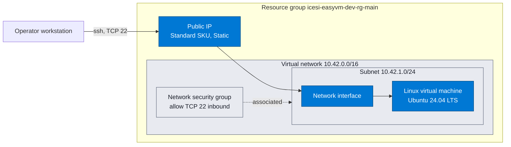
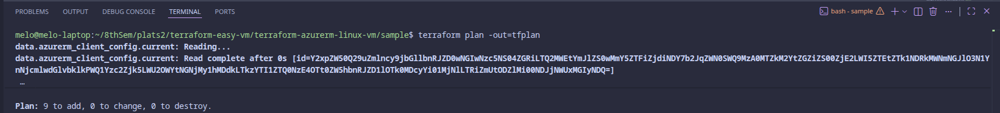
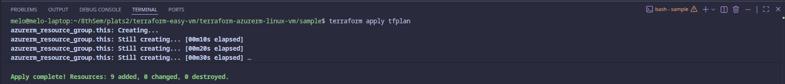
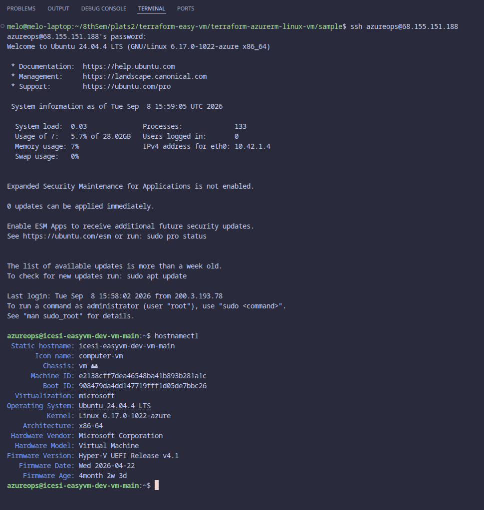
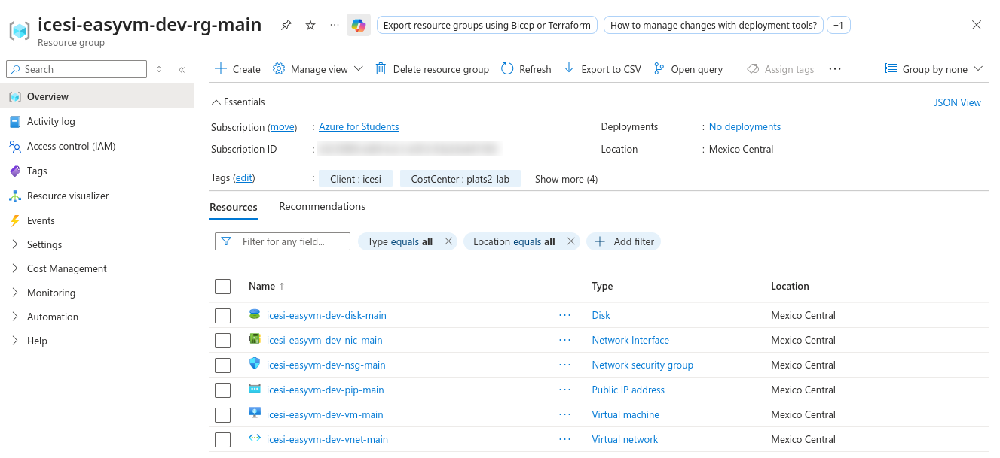
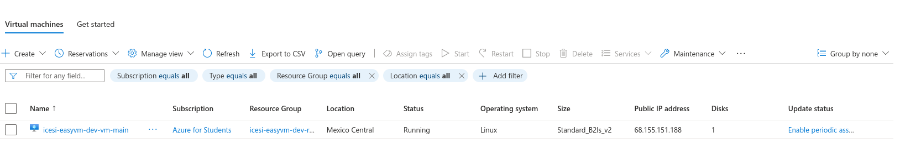
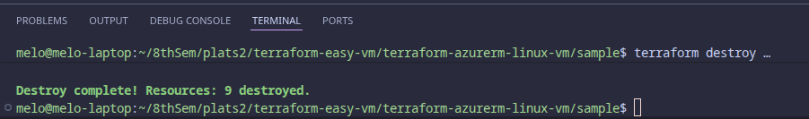

# terraform-azurerm-linux-vm

[](https://developer.hashicorp.com/terraform)
[](https://registry.terraform.io/providers/hashicorp/azurerm/latest)
[](https://azure.microsoft.com/explore/global-infrastructure/geographies/)

Terraform module that provisions a Linux virtual machine on Azure, reachable
over public SSH with a local user and password, deployed in the Mexico Central
region.

The module creates a public IP, a network interface and the virtual machine.
Everything else arrives as an input, which lets the same module drop into any
existing network. The `sample/` directory contains a runnable example that
builds its own network and deploys the machine end to end.

## Overview

| Item | Value |
| --- | --- |
| Cloud | Azure |
| Region | `mexicocentral` |
| Operating system | Ubuntu Server 24.04 LTS, Gen2, x64 |
| Default size | `Standard_B2ls_v2`, 2 vCPU, 4 GiB |
| Access | SSH on TCP 22, local user and password |
| Resources created | 9 |

## Architecture



Blue resources are created by the module. Grey resources are the network
scaffolding created by the example.

## Repository layout

```
terraform-azurerm-linux-vm/
├─ .github/workflows/terraform-ci.yml   Format, validate, test, lint, security scan
├─ .tflint.hcl                          Linter configuration
├─ README.md
├─ data.tf                              No data sources, lookups live in the caller
├─ locals.tf                            Tag resolution
├─ main.tf                              Public IP, network interface, virtual machine
├─ outputs.tf                           Identifiers, addresses and the SSH command
├─ providers.tf                         Provider contract
├─ variables.tf                         Typed and validated inputs
├─ versions.tf                          Version pinning
├─ docs/evidence/                       Deployment screenshots
├─ sample/                              Runnable example, see sample/README.md
│  ├─ data.tf
│  ├─ locals.tf                         Name construction and value injection
│  ├─ main.tf                           Module invocation only
│  ├─ outputs.tf
│  ├─ prerequisites.tf                  Resource group, network, security group
│  ├─ providers.tf
│  ├─ terraform.tfvars                  Environment values, no secrets
│  ├─ variables.tf
│  └─ versions.tf
└─ tests/defaults.tftest.hcl            Offline test suite, mocked provider
```

## Requirements

| Component | Version | Notes |
| --- | --- | --- |
| Terraform | 1.9 or newer | 1.7 or newer is required for `mock_provider` in the tests |
| azurerm provider | 5.0 or newer, below 6.0 | Pinned to `~> 5.4` in the example |
| Azure CLI | 2.60 or newer | Supplies credentials to the provider |
| Azure subscription | Contributor on the target scope | Quota for 2 vCPU in `mexicocentral` |

Confirm the region quota before deploying.

```bash
az vm list-usage -l mexicocentral -o table | grep -E "Total Regional vCPUs|Bsv2"
```

## Step by step

### 1. Authenticate

```bash
az login
az account set --subscription "<subscription-id>"
az account show --output table
```

The provider reads credentials from the Azure CLI context, so no secret is
stored in the repository.

### 2. Export the runtime values

The subscription ID and the administrator password are injected as environment
variables and never written to `terraform.tfvars`.

```bash
cd sample

export TF_VAR_subscription_id="$(az account show --query id -o tsv)"

read -rsp 'Admin password: ' TF_VAR_admin_password
export TF_VAR_admin_password
echo
```

The password must be 12 to 72 characters and must contain at least three of the
four character classes, lowercase, uppercase, digit and special. Anything weaker
is rejected at plan time.

### 3. Review the plan

```bash
terraform init
terraform validate
terraform plan -out=tfplan
```

The plan reports nine resources to add.



### 4. Apply

```bash
terraform apply tfplan
```



### 5. Read the outputs

```bash
terraform output
```

The `ssh_commands` output carries the ready to run command. The password never
appears in any output.

### 6. Connect over SSH

```bash
ssh azureops@<public-ip>
```

Accept the host key fingerprint on the first connection and supply the password
exported in step 2.



### 7. Verify in the portal

The resource group holds the nine resources created by the run.



The virtual machine reports status Running in Mexico Central.



### 8. Tear down

```bash
terraform destroy
```



## Inputs

| Name | Type | Required | Description |
| --- | --- | --- | --- |
| `client` | `string` | yes | Client or business unit, 1 to 10 lowercase alphanumeric characters |
| `project` | `string` | yes | Project name, 1 to 15 lowercase alphanumeric characters |
| `environment` | `string` | yes | One of `dev`, `qa` or `pdn` |
| `location` | `string` | yes | Azure region short name, for example `mexicocentral` |
| `resource_group_name` | `string` | yes | Existing resource group that hosts the virtual machines |
| `common_tags` | `map(string)` | yes | Must define `Client`, `Project`, `Environment`, `Owner` and `CostCenter` |
| `admin_password` | `string`, sensitive | yes | Local administrator password, injected through `TF_VAR_admin_password` |
| `virtual_machines` | `map(object)` | yes | Virtual machines to create, keyed by the `{key}` naming component |

### The `virtual_machines` object

| Field | Type | Default | Description |
| --- | --- | --- | --- |
| `name` | `string` | required | Final virtual machine name, built by the caller |
| `network_interface_name` | `string` | required | Final network interface name |
| `public_ip_name` | `string` | required | Final public IP name |
| `os_disk_name` | `string` | required | Final operating system disk name |
| `subnet_id` | `string` | required | Azure resource ID of the target subnet |
| `size` | `string` | required | Azure virtual machine size |
| `admin_username` | `string` | required | Local administrator account, reserved names rejected |
| `zone` | `string` | `null` | Availability zone, regional placement when omitted |
| `os_disk_caching` | `string` | `ReadWrite` | One of `None`, `ReadOnly` or `ReadWrite` |
| `os_disk_storage_account_type` | `string` | `StandardSSD_LRS` | Managed disk tier |
| `os_disk_size_gb` | `number` | `30` | Between 30 and 4095 |
| `public_ip_sku` | `string` | `Standard` | Only `Standard` is allowed |
| `public_ip_allocation_method` | `string` | `Static` | Forced to `Static` for the Standard SKU |
| `encryption_at_host_enabled` | `bool` | `false` | Requires the `EncryptionAtHost` feature to be registered |
| `accelerated_networking` | `bool` | `false` | Depends on the chosen size |
| `source_image_reference` | `object` | required | `publisher`, `offer`, `sku` and `version` |
| `additional_tags` | `map(string)` | `{}` | Merged on top of the shared tags |

## Outputs

| Name | Description |
| --- | --- |
| `virtual_machine_ids` | Azure resource ID per virtual machine |
| `virtual_machine_names` | Physical name per virtual machine |
| `admin_usernames` | Local administrator account per virtual machine |
| `public_ip_addresses` | Public IPv4 address per virtual machine |
| `private_ip_addresses` | Private IPv4 address per virtual machine |
| `network_interface_ids` | Network interface resource ID per virtual machine |
| `public_ip_ids` | Public IP resource ID per virtual machine |
| `ssh_commands` | Ready to run SSH command per virtual machine |

## Naming convention

Every physical name follows `{client}-{project}-{environment}-{type}-{key}`,
lowercase, hyphen separated, at most 28 characters. Names are built once in
`sample/locals.tf` and passed into the module, so a change to the convention
touches a single file. A validation in `variables.tf` rejects anything that
breaks the pattern.

| Type | Abbreviation | Resulting name |
| --- | --- | --- |
| Resource group | `rg` | `icesi-easyvm-dev-rg-main` |
| Virtual network | `vnet` | `icesi-easyvm-dev-vnet-main` |
| Subnet | `snet` | `icesi-easyvm-dev-snet-main` |
| Network security group | `nsg` | `icesi-easyvm-dev-nsg-main` |
| Security rule | `nsgr` | `icesi-easyvm-dev-nsgr-ssh` |
| Public IP | `pip` | `icesi-easyvm-dev-pip-main` |
| Network interface | `nic` | `icesi-easyvm-dev-nic-main` |
| Virtual machine | `vm` | `icesi-easyvm-dev-vm-main` |
| Operating system disk | `disk` | `icesi-easyvm-dev-disk-main` |

## Design notes

**Separation between module and example.** The module owns only the compute
resources. The network lives in `sample/prerequisites.tf`, so the module can be
reused against an existing virtual network by passing a different `subnet_id`.

**Secrets stay out of the repository.** `admin_password` is declared
`sensitive` and injected through `TF_VAR_admin_password`. The `terraform.tfvars`
file carries only non sensitive environment values.

**Configuration flows in one direction.** Values start in `terraform.tfvars`,
get typed in `variables.tf`, get transformed in `locals.tf` and reach the module
in `main.tf`. No transformation logic sits inside the module block.

**`for_each` over `count`.** Resources are keyed by map key rather than by list
index, so removing one machine from the map leaves the others untouched in
state.

**Input validation.** Every variable declares a type, a description and at least
one validation rule, so mistakes surface during `terraform plan` instead of
halfway through an apply.

## Security notes

The exercise requires public SSH with a password, which is the least secure of
the available options. The configuration is honest about it.

- The security rule opens TCP 22 to `0.0.0.0/0`. Replace
  `network_security_rules.ssh.source_address_prefixes` in `terraform.tfvars`
  with the operator network before using this anywhere real, or put Azure
  Bastion in front and drop the public IP entirely.
- Password authentication stays enabled by design. Production workloads should
  set `admin_ssh_key` and turn `disable_password_authentication` back on.
- Checkov reports `CKV_AZURE_10` as passing here. That verdict is misleading,
  the check inspects the singular `source_address_prefix` attribute while the
  code uses the plural `source_address_prefixes`. Treat the exposure as real.
- The four Checkov findings caused by password authentication are skipped inline
  in `main.tf` with the reason attached, so the pipeline still fails on anything
  else.
- Implicit outbound internet access is disabled on the subnet. The machine
  egresses through its own public IP.
- Managed disks are encrypted at rest by the platform. `encryption_at_host_enabled`
  extends that to the temporary disk and the cache once the
  `Microsoft.Compute/EncryptionAtHost` feature is registered.

## Deprecation check

Every construct was verified against the `azurerm` 5.4.0 schema and the current
Azure retirement notices.

| Deprecated construct | Replacement used here |
| --- | --- |
| `azurerm_virtual_machine` | `azurerm_linux_virtual_machine` |
| Basic SKU public IP, retired 30 September 2025 | Standard SKU with `Static` allocation |
| `azurerm_subnet.address_prefix` | `address_prefixes` |
| `azurerm_subnet.network_security_group_id`, absent from azurerm 5.x | `azurerm_subnet_network_security_group_association` |
| `azurerm_network_interface.enable_accelerated_networking` | `accelerated_networking_enabled` |
| Provider `skip_provider_registration` | `resource_provider_registrations`, left at its default |
| Implicit subscription selection | `subscription_id` on the provider, required since azurerm 4.0 |
| Default outbound internet access, being retired | `default_outbound_access_enabled = false` |
| `security_rule` nested inside the network security group | Discrete `azurerm_network_security_rule` resources |
| Ubuntu 20.04 offer `0001-com-ubuntu-server-focal` | `Canonical:ubuntu-24_04-lts:server:latest` |

Region availability was checked against the target subscription. In
`mexicocentral` the burstable B series is restricted in availability zone 1
only, so the machine is deployed regionally with `zone` left unset.

## Testing

The suite runs offline against a mocked provider, so it creates nothing and
needs no credentials.

```bash
terraform init -backend=false
terraform test
```

Seven runs cover the produced resource set, the tags applied to every resource,
and six validation paths including weak passwords, reserved administrator names,
oversized names, incomplete tags and an empty subnet ID.

Static analysis mirrors the pipeline.

```bash
terraform fmt -check -recursive -diff
tflint --recursive
checkov -d . --framework terraform --compact
```

`terraform validate` does not run against the module on its own, Terraform
reports the aliased provider as missing for any module that declares
`configuration_aliases`. The module is validated through the example and through
the test suite.

## Cost

One `Standard_B2ls_v2` instance, a 30 GiB StandardSSD managed disk and one
Standard public IP. Run `terraform destroy` as soon as the evidence is captured,
the instance and the static address bill by the hour while they exist.

## References

- [Example usage](sample/README.md)
- [Evidence capture guide](docs/evidence/README.md)
- [azurerm provider documentation](https://registry.terraform.io/providers/hashicorp/azurerm/latest/docs)
- [Azure Basic SKU public IP retirement](https://azure.microsoft.com/updates/upgrade-to-standard-sku-public-ip-addresses-in-azure-by-30-september-2025-basic-sku-will-be-retired/)
